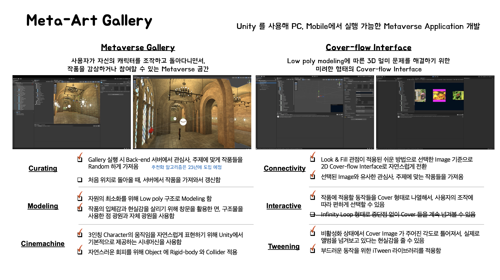

# MetaArt

이 프로젝트는 [연세대학교 공학대학원](https://eyonsei.yonsei.ac.kr/main.asp) 인공지능전공 2022년 팀 프로젝트로 수행한 과제입니다.

저희는 디지털 아트와 메타버스에 관심이 많은 사람들이 모여 만들어진 메타아트 팀입니다.  
저희는 이미지 뿐만이 아니라, 텍스트, 실제 물체도 가상 공간에 전시해보자는 목적으로 메타버스 공간상에 갤러리를 만들었습니다.

### 개요

메타버스는 현실보다 접근하기 쉬우며, 온라인에서보다 더 인상깊은 작품 감상이 가능합니다.  
메타버스 갤러리는 `누구나 쉽게 미술에 접근할 수 있는 가상현실 수단`에서 `작가의 아이디어부터 실제 물체까지도 Art로 만들어보는 도구` 를 구현한 겁니다.

### Architecture

모든 사람의 아이디어, 사진, 그리고 실제 모습까지도 작품으로 만들어내기 위해 저희는 다음과 같은 3개의 Project 를 통합해서 구현했습니다.  
이를 위해 DALL-E, Nerf 등의 Deep-Learning Network와 RESTful API, 그리고 Unity 등 다양한 개발 Tool 을 사용했습니다.

- [MetaArtGallery](https://github.com/maroomir/MetaArtGallery)
- [MetaArtServer](https://github.com/maroomir/MetaArtServer)
- [MetaArtClient](https://github.com/maroomir/MetaArtClient)

---

## MetaArtGallery

MetaArtGallery 는 Unity 기반으로 PC, Mobile 에서 실행 가능함을 목표로 하는 Metaverse 환경입니다.  
주요 기능은 아래와 같습니다.

### Curating

Gallery 실행시 Back-end 서버에서 관심사, 주제에 맞게 작품들을 랜덤하게 가져옵니다.

### Modeling

자원의 최소화를 위해 Low-poly modeling 을 사용했습니다.  
또한 작품의 입체감과 현실감을 살리기 위해 창문을 활용한 면, 구조물을 사용한 점 광원을 사용했으며, 고정 사물에 그림자를 남기기 위해 Baked 작업을 수행했습니다.

### Cinemachine

3인칭 캐릭터의 움직임을 자연스럽게 표현하기 위해 Unity 에서 기본적으로 제공하는 시네머신을 사용했습니다.  
자연스러운 회피를 위해 Object에 Rigid-body 와 Collider 를 적용했습니다.

### Connectivity

선택한 Image 기준으로 2D Cover-flow interface 도 사용 가능하게 기능을 추가했습니다.  
또한 선택한 Image 와 유사한 관심사, 주제를 가진 작품들을 가져오게 해서 2D Interface 만으로도 편히 감상할 수 있게 했습니다.

---

## Demo 영상

