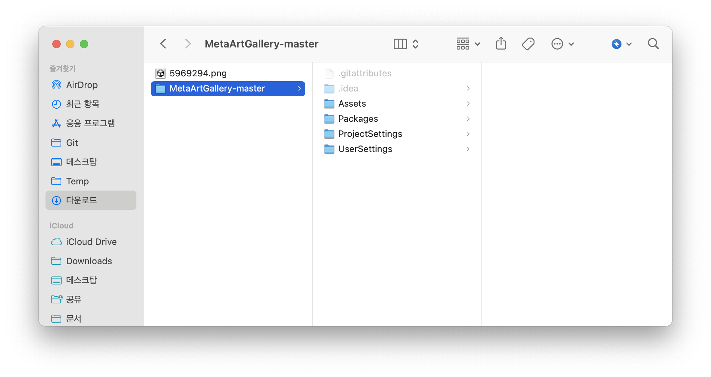
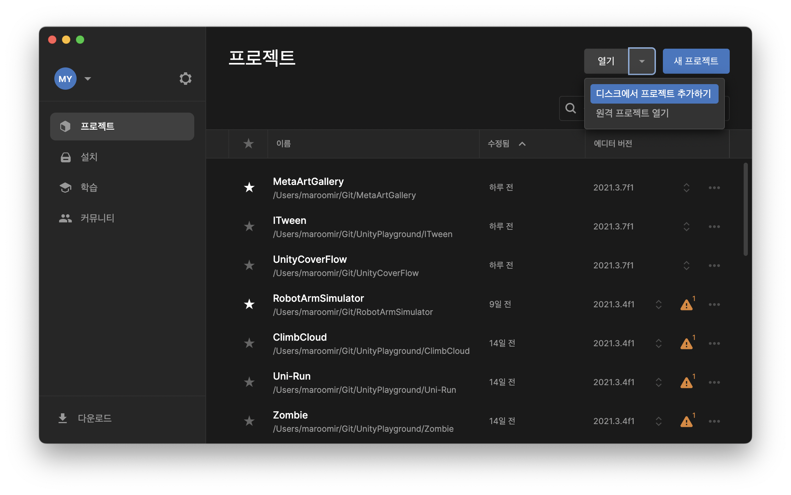
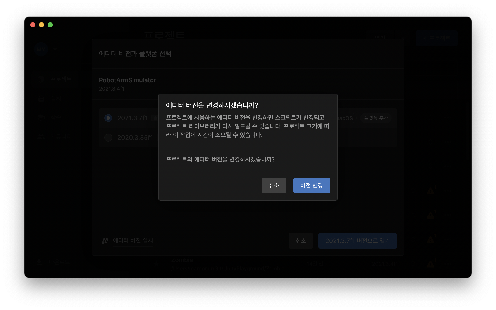
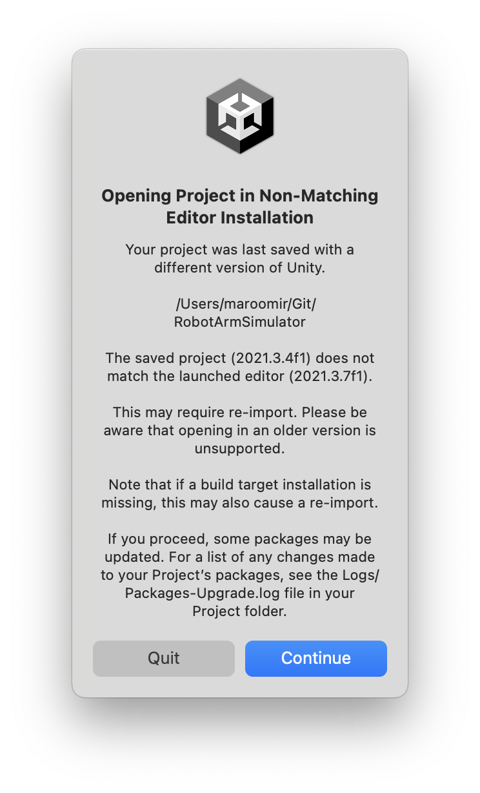
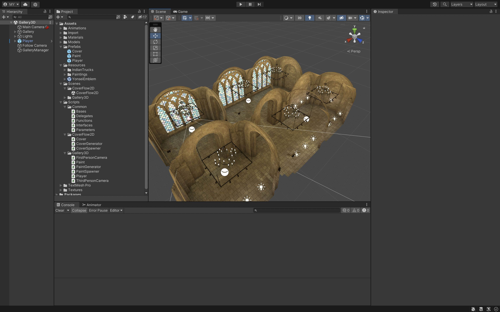
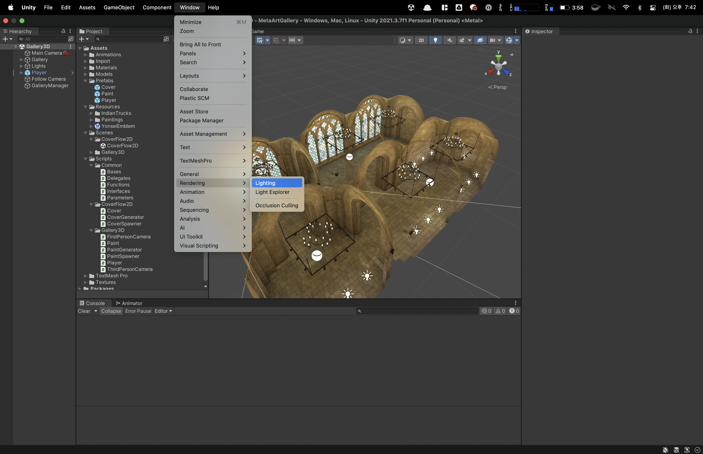
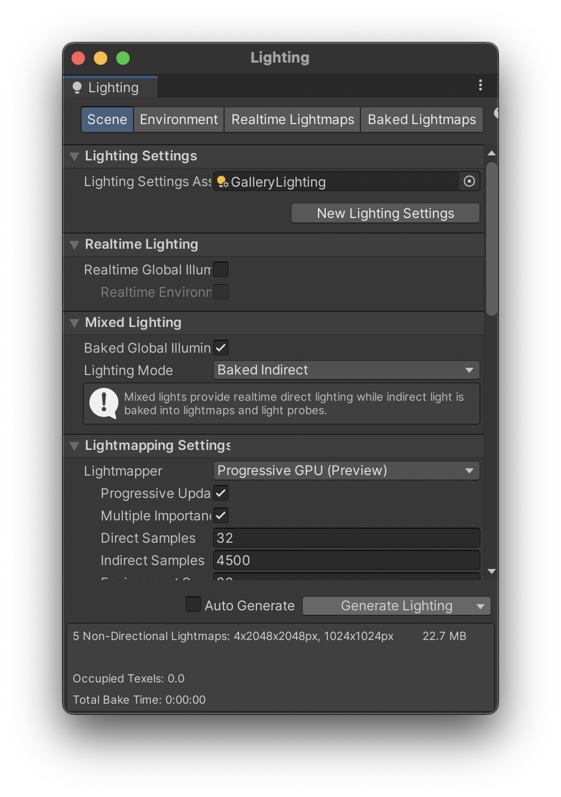
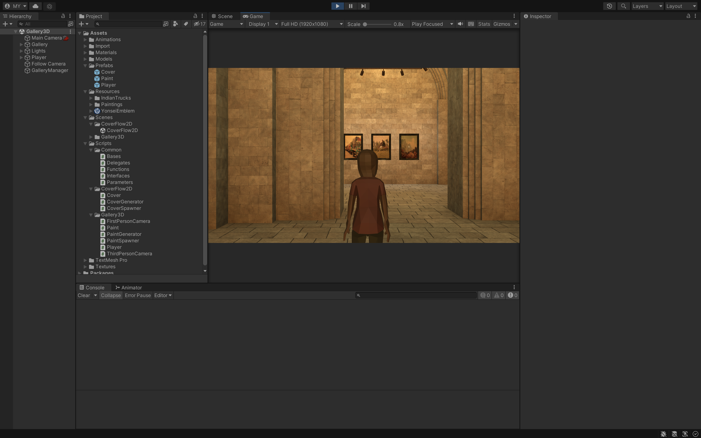
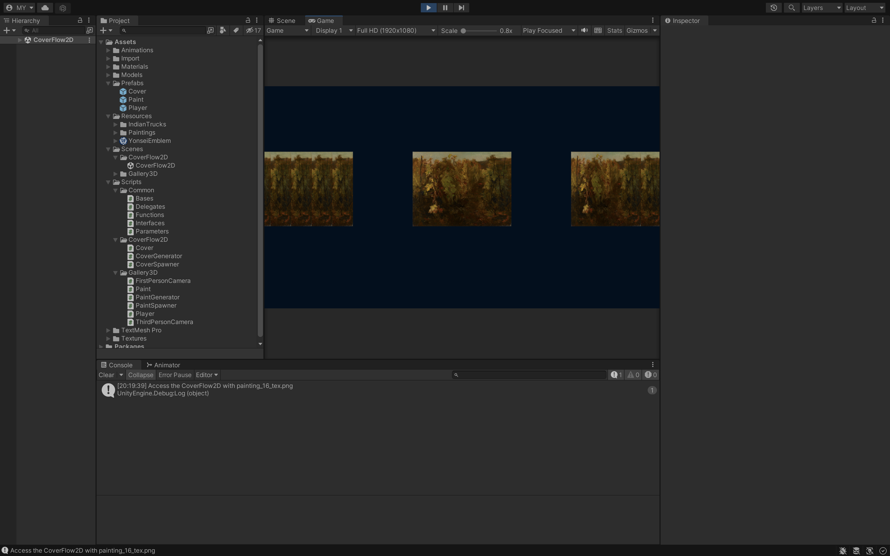
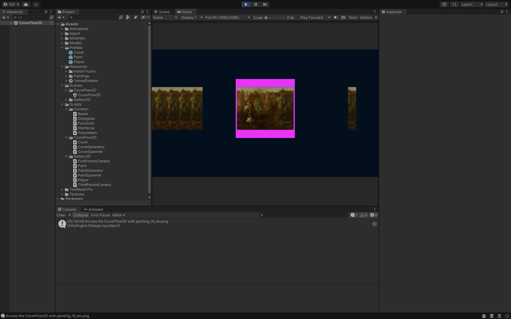

# MetaArtGallery 사용법

## 준비

MetaArtGallery를 실행하기 위해서는 먼저 Unity 홈페이지에서 Unity Hub를 다운로드 해야합니다.

[다운로드](https://unity.com/kr/download)

다운로드하고 Unity Hub를 설치하면 라이센스 갱신을 위해 Unity 회원가입을 헤야합니다. 따라서 미리 Unity 홈페이지에서 [회원가입](https://id.unity.com/en/conversations/dd5dcefc-c9f3-4ac3-b210-1577cfdb483c01df)을 해둡니다.  
현재(22년 8월) 기준 MetaArtGalley는 Unity 2021.3.7f 버전에 최적화 되어있습니다. Unity Hub에서 해당 버전을 다운로드 받습니다.

> 참고로 매년 새로운 기능이 Update 되는 최신 버전은 2022.1 으로 시작하는 버전이며, 2년간 장기지원(LTS)을 보장하는 안정화 버전이 2021.3 으로 시작하는 버전입니다.

[허브를 이용하여 Unity 설치 - Unity 매뉴얼](https://docs.unity3d.com/kr/2018.4/Manual/GettingStartedInstallingHub.html)

Source 확인을 위해선 IDE 사용을 장려합니다. 현재 Unity 개발자들이 폭넓게 사용하는 IDE는 아래와 같습니다.

- Visual Studio Community / Pro
- Visual Studio Code
- Rider

참고로 저는 JetBrain 사 제품을 좋아하기 때문에 Rider를 사용합니다. 다만 Rider는 구독제/유료이기 때문에 이 점 참고하시길 바랍니다.

## MetaArtGallery 다운로드

MetaArtGallery는 제 Github에 올려놨습니다. Git을 사용할 줄 아시면 git clone 으로 받으시면 되고, 그렇지 않으면 웹 저장소에서 압축본을 직접 받으셔도 됩니다. Source 에는 각종 Mesh 들이 들어가있기 때문에 약 600MB 정도의 용량을 차지합니다.

[https://github.com/maroomir/MetaArtGallery](https://github.com/maroomir/MetaArtGallery)

다운로드 받으시면 MetaArtGallery 폴더 아래에 Assets, Packages 등으로 이뤄진 폴더가 있을겁니다.

Unity를 실행하고 열기 > 디스크에서 프로젝트 추가하기를 클릭하고, MetaArtGallery 폴더를 클릭합니다. 그러면 Unity에서 자동으로 meta 파일을 분석해서 프로젝트를 엽니다.

만약 Unity 버전이 맞지 않으면 프로젝트를 열던 도중에 경고 팝업 창들이 생길겁니다. 여러분이 받은 버전이 2021.3.X 로 시작되는 버전이 맞다면 무리없이 호환이 될 것이기 때문에 걱정하지 마시고 작업을 계속 진행하시거나 continue 를 누르시면 됩니다.

# MetaArtGallery 시작하기

MetaArtGallery는 단순한 두 가지 장면(Scenes)으로 이뤄져있습니다. 첫번째, Gallery3D.unity 은 3D 프롭들로 만들어진 갤러리 형태의 Mesh 입니다.

여러분이 처음 Source 를 받아서 열었을 때 주변이 깜깜하게 암전되어 보일 수도 있습니다. 이 경우 Bake 를 통해 조명(Lights) 프롭들을 Scene에 적용하는 작업이 필요합니다.

> 실행 조건에 따라, 화면이 암전되어 있지 않으면 아래 과정을 굳이 실행할 필요가 없습니다. 다만 제가 작업 환경을 옮겨가면서 해보니까, LightSetting 프롭 문제인지 화면이 암전되어있더라고요.

1. 먼저 Windows / Rendering / Lightning 으로 들어갑니다.

   

2. Lightning 팝업 창이 나오면, 아래에 Generate Lightning 버튼을 클릭합니다.
   이후 사용하시는 컴퓨터의 사양에 따라 다르지만, 일반적으로 30분 정도 기다리면 작업이 끝납니다.

   > Apple M1 Pro 기준 20분, NVidia RTX2070 기준으로 30분이면 Bake 작업이 끝납니다.
   그래픽 카드가 없는 저사양 PC인 경우 1시간 넘게 걸릴수도 있습니다.

   

이제 준비가 되었으면 상단 중앙에 Play 버튼을 눌러보세요. 그러면 Gallery3D Scene 이 실행됩니다.

현재 구현 정도 및 한계로 단순하게 한 홀로 구성된 갤러리만 다닐 수 있습니다. 구현 예정 요소에 대해 설명하면 다음과 같습니다.

1. 여성 캐릭터 및 애니메이터 (Sample 프롭)
2. w시네마틱 카메라 (CineCamera, 가상 오브젝트)
3. 작품들 (Arts, Asset store에서 구매)
4. 작품 전시를 위한 가상 평면 (Planes)
5. 작품 전시 공간 (Meshs, Asset store에서 구매)
6. 전체 메뉴 프롭 (미구현)

갤러리에서의 상호 작용은 단순합니다. 키보드 WASD 키를 누르면, 캐릭터가 이동합니다.

캐릭터를 이동시키다가 원하는 작품에 다가가면, 해당 작품에 대한 Image 정보가 CoverFlow2D.unity 로 넘어갑니다. CoverFlow Scene은 사용자가 원하는 동작을 선택 및 적용해볼 수 있는 UI 이며, 적혀있는대로 커버 플로우 형태로 되어있습니다.

커버플로우는 키보드 우측 아래에 화살표 키를 통해 조작이 가능합니다. 현재는 MetaArtServer 가 구축이 되어있지 않기 때문에 같은 정지 화상으로만 이뤄져있습니다.

선택을 하면 상세 설명들을 Pop-up 창처럼 보여줄 예정입니다. 이 부분 역시 아직 구현은 안되었습니다.